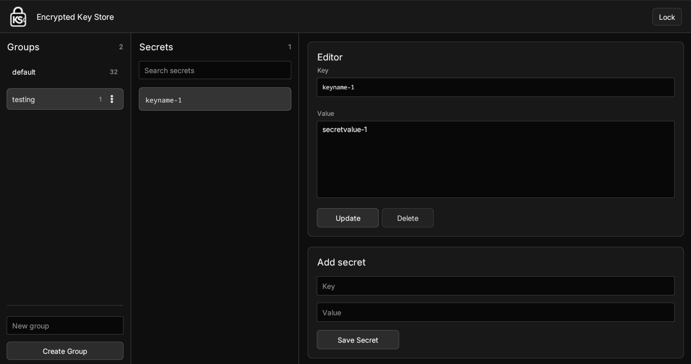

# KS

KS is an encrypted key store with both a desktop app and a terminal CLI.

Secrets are stored locally in an encrypted vault. Running `ks` with no command opens the desktop app; running CLI commands lets you manage the same vault from a terminal.

## Desktop App

```sh
ks
```

or:

```sh
ks app
```

The desktop app can create or unlock the vault, manage groups, search secrets, edit keys and values, and add/delete secrets.

### Desktop View



## CLI Quick Start

Create or unlock the vault for terminal commands:

```sh
ks login
```

Set a secret:

```sh
ks set github_token ghp_example
```

List secret keys:

```sh
ks list
```

Read a secret value:

```sh
ks get github_token
```

Delete a secret:

```sh
ks delete github_token
```

End the terminal session:

```sh
ks logout
```

## Login And Sessions

Most CLI commands use a terminal login session, so run `ks login` first. If no vault exists yet, `ks login` creates one and prompts for a new password.

You can provide the password through `KS_PASSWORD`:

```sh
KS_PASSWORD='your-password' ks login
```

Or specify another environment variable:

```sh
KS_VAULT_PASSWORD='your-password' ks login --password-env KS_VAULT_PASSWORD
```

## Groups

Show status and secret counts:

```sh
ks status
```

List all groups:

```sh
ks groups
```

Create a group and switch to it:

```sh
ks group create work
```

Switch active group:

```sh
ks switch work
```

Delete a group:

```sh
ks group delete work
```

Deleting a group always asks for the vault password, even if you are already logged in for terminal commands.

Login and switch group immediately:

```sh
ks login --group work
```

## Commands

```text
ks app                  Open the desktop application
ks login                Unlock or create the vault for terminal commands
ks logout               Remove the terminal login session
ks status               Show active group and secret counts
ks switch <group>       Switch the active group
ks list                 List keys in the active group
ks list --values        List keys and values
ks get <key>            Print a value from the active group
ks set <key> <value>    Set a key/value in the active group
ks delete <key>         Delete a key from the active group
ks groups               List all groups
ks group create <name>  Create a group and switch to it
ks group delete <name>  Delete a group after verifying the vault password
```

Use `ks --help` or `ks <command> --help` for the latest command help.

## License

Licensed under the Apache License, Version 2.0. See [LICENSE](LICENSE).
