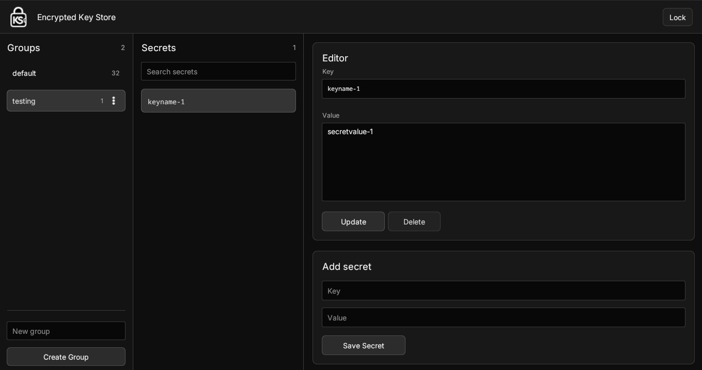

# KS

KS is an encrypted key store with both a desktop app and a terminal CLI.

Secrets are stored locally in an encrypted vault. Running `ks` with no command opens the desktop app; running CLI commands lets you manage the same vault from a terminal.

## Desktop App

```sh
ks
```

or:

```sh
ks app
```

The desktop app can create or unlock the vault, manage groups, search secrets, edit keys and values, and add/delete secrets.

### Desktop View



## Install From Source

Build and install both the desktop app and the `ks` terminal command:

```sh
./scripts/install-local.sh
```

On macOS this installs `KS.app` to `~/Applications/KS.app` and links `ks` into `~/.local/bin`. On Linux it installs the binary, desktop entry, and icon under the usual per-user locations.

To install only the terminal command:

```sh
./scripts/install-local.sh --cli-only
```

Make sure the chosen bin directory is on your `PATH`. By default that is `~/.local/bin`; you can override it:

```sh
KS_BIN_DIR="$HOME/bin" ./scripts/install-local.sh --cli-only
```

## CLI Quick Start

Create or unlock the vault for terminal commands:

```sh
ks login
```

Set a secret:

```sh
ks set github_token ghp_example
```

List secret keys:

```sh
ks list
```

Search secret keys (case-insensitive):

```sh
ks search token
```

Read a secret value:

```sh
ks get github_token
```

Delete a secret:

```sh
ks delete github_token
```

End the terminal session:

```sh
ks logout
```

## Login And Sessions

Most CLI commands use a terminal login session, so run `ks login` first. If no vault exists yet, `ks login` creates one and prompts for a new password.

You can provide the password through `KS_PASSWORD`:

```sh
KS_PASSWORD='your-password' ks login
```

Or specify another environment variable:

```sh
KS_VAULT_PASSWORD='your-password' ks login --password-env KS_VAULT_PASSWORD
```

## Groups

Show status and secret counts:

```sh
ks status
```

List all groups:

```sh
ks groups
```

Create a group and switch to it:

```sh
ks group create work
```

Switch active group:

```sh
ks switch work
```

List or search another group without switching the active group:

```sh
ks -g work list
ks -g work search token
```

Both commands print keys only by default; add `--values` to print matching values. `-g` (or `--group`) also works after the command.

Delete a group:

```sh
ks group delete work
```

Deleting a group always asks for the vault password, even if you are already logged in for terminal commands.

Login and switch group immediately:

```sh
ks login --group work
```

## Commands

```text
ks app                  Open the desktop application
ks login                Unlock or create the vault for terminal commands
ks logout               Remove the terminal login session
ks status               Show active group and secret counts
ks switch <group>       Switch the active group
ks list                 List keys in the active group
ks list --values        List keys and values
ks search <query>       Search keys in the active group (case-insensitive)
ks search <query> -v    Search keys and print values
ks -g <group> list      List keys in a group without switching
ks -g <group> search <query>  Search keys in a group without switching
ks get <key>            Print a value from the active group
ks set <key> <value>    Set a key/value in the active group
ks delete <key>         Delete a key from the active group
ks groups               List all groups
ks group create <name>  Create a group and switch to it
ks group delete <name>  Delete a group after verifying the vault password
ks start-mcp-server   Start the authenticated local MCP server on port 8765
```

Use `ks --help` or `ks <command> --help` for the latest command help.

## MCP Server and API Keys

Open the desktop app, unlock the vault, then choose Settings → API Keys. Create a named API key, select one or more groups, and set each group's access to read-only or read + write. Choose an expiry date (through the end of that day in UTC) or unlimited expiry. Copy the JWT when shown; it is not stored for later display. Editing a key rotates its token and revokes the previous one. Deleting a key revokes it immediately. Renaming or deleting a group invalidates tokens scoped to that group; edit the key to issue a replacement. API keys cannot be created from the CLI or via MCP.

Start the server with your vault password (it prompts if `KS_PASSWORD` is unset):

```sh
ks start-mcp-server
ks start-mcp-server --port 8989
```

The Streamable HTTP endpoint is `http://127.0.0.1:8765/mcp` by default. Configure your MCP client to send `Authorization: Bearer <your-JWT>` on every request. The server only listens on localhost, requires a valid token even for initialization and tool discovery, and checks group permissions for each tool. It provides `list_groups`, `list_keys`, `search_keys`, `get_secret`, `set_secret`, and `delete_secret`. A read-only group cannot use write tools. The server must be restarted after changing the vault password, as it keeps the vault unlock key in memory.

If the desktop and MCP server change the vault at the same time, a stale write fails instead of overwriting newer data. Log out and unlock the desktop app again (or retry the MCP request) before saving.

## License

Licensed under the Apache License, Version 2.0. See [LICENSE](LICENSE).
